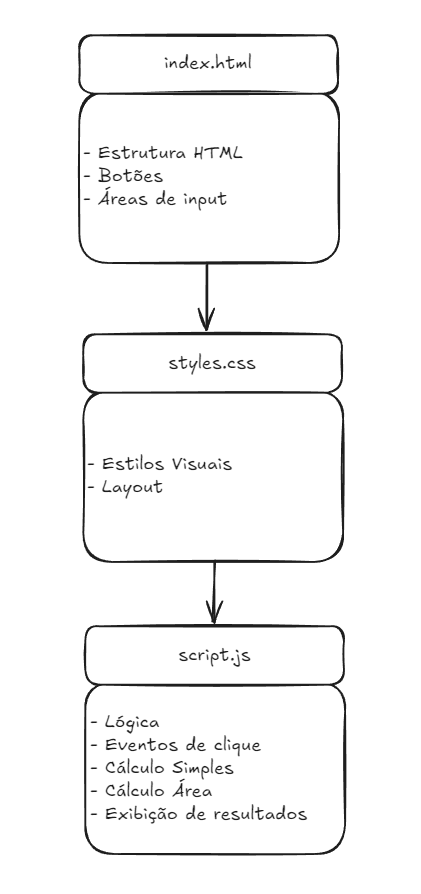
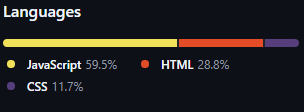
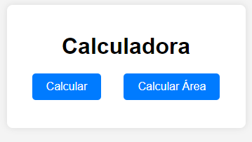
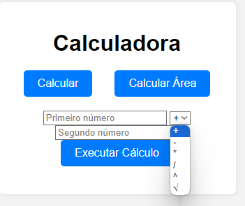
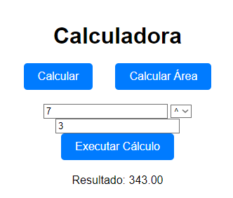
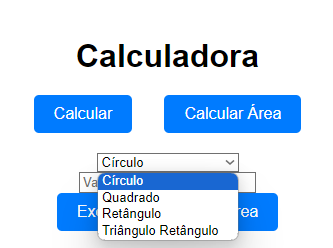
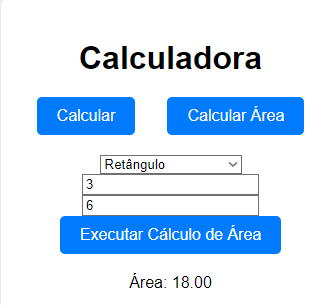

# CalcularWeb

Este projeto é uma **Calculadora Web** desenvolvida com **HTML**, **CSS** e **JavaScript**. Ela permite que os usuários realizem operações matemáticas básicas e cálculos de áreas de formas geométricas diretamente no navegador.

## Funcionalidades

### Operações Matemáticas
A calculadora permite realizar as seguintes operações:
- Adição (`+`)
- Subtração (`-`)
- Multiplicação (`*`)
- Divisão (`/`)
- Exponenciação (`^`)
- Radiciação (`√`)

Não permite divisões com zero e aceita valores com `ponto 1.3` e com `vírgula 1,3`.

### Cálculo de Áreas de Formas Geométricas
Além das operações matemáticas, a calculadora permite calcular a área de diferentes formas geométricas:
- **Círculo** (com base no raio)
- **Quadrado** (com base no lado)
- **Retângulo** (com base na largura e altura)
- **Triângulo Retângulo** (com base na base e altura)

## Estrutura do Projeto

O projeto é organizado da seguinte maneira:
### Diagrama do Projeto

## Tecnologias Utilizadas
**HTML5**: Para a estruturação do conteúdo.

**CSS3**: Para o estilo visual da aplicação.

**JavaScript**: Para a lógica e interatividade.

## Como Utilizar

Acesse o link: "https://calcularweb.netlify.app"

Escolha uma das opções

### Calculo Simples
Preencha os dois valores e escolha um sinal de operação

Clique em **Executar Cálculo** para exibir o resultado

### Calculo Área

Escolha a forma e preencha os valores

Clique em **Executar Cálculo** para exibir o resultado

## Melhorias Futuras

* Implementação de mais operações matemáticas avançadas.
* Adicionar validações mais robustas para entrada de dados.
* Melhorar o design responsivo para diferentes dispositivos.
* Vincular as banco de dados e exibir histórico

## Contribuições
Sinta-se à vontade para contribuir com melhorias no código, correções de bugs ou novas funcionalidades.
* Faça um fork do projeto.
* Crie uma branch com suas alterações.
* Envie um Pull Request.

## Autor
**Guustavohgp**
